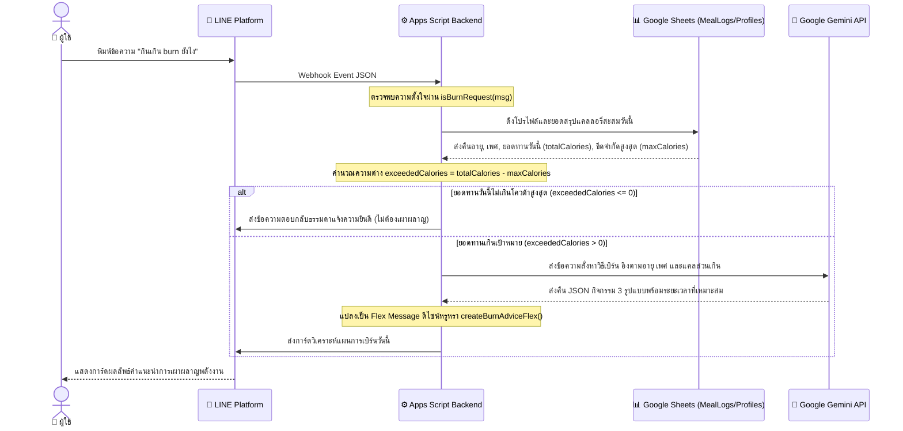

# แผนการพัฒนาคุณสมบัติระบบวิเคราะห์และแนะนำการเผาผลาญพลังงานส่วนเกิน (Excess Calorie Burn Advice System)

ฟีเจอร์นี้มีเป้าหมายเพื่อตอบข้อซักถามของผู้ใช้เมื่อกินแคลลอรี่เกินเกณฑ์ โดยช่วยคำนวณแคลลอรี่ส่วนเกินจากโปรไฟล์อายุและเพศในแต่ละวัน แล้วประสานงานกับ AI เพื่อหาวิธีออกกำลังกาย 3 วิธีที่เหมาะสมเพื่อเผาผลาญแคลลอรี่ส่วนเกินนั้นออก โดยนำเสนอผ่านหน้าจอแชทแบบ Flex Message ดีไซน์พรีเมียม

---

## 🗺️ การออกแบบโครงสร้างและการไหลของข้อมูล (System Design)

ระบบนี้จะทำงานเชื่อมโยงข้อมูลหลายระบบตามผังดังนี้ครับ:



---

## 🛠️ รายละเอียดการแก้ไขโค้ดโครงการ

### 1. การตรวจจับและคัดแยกความตั้งใจผู้ใช้ (Keyword Matching)
เพิ่มฟังก์ชัน `isBurnRequest(message)` ใน [Code.gs](file:///d:/Project/line-calories-ai-chatbot/Code.gs) เพื่อตรวจจับคำสืบค้น เช่น `"กินเกิน burn ยังไง"`, `"เบิร์นยังไง"`, `"วิธีลดแคลเกิน"` ฯลฯ

### 2. การดึงชุดข้อมูลสำหรับวิเคราะห์ (Data Aggregation Refactoring)
* สร้างฟังก์ชันร่วม `getTodayCaloriesData(userId, userProfile)` เพื่อลดความซ้ำซ้อนของคำสั่งอ่านฐานข้อมูล โดยทำหน้าที่ดึงผลรวมแคลลอรี่สะสมของวันนี้ รายการอาหาร และค่าเป้าหมายแคลลอรี่สูงสุดจำเพาะบุคคลขึ้นมาในครั้งเดียว
* ปรับปรุงฟังก์ชัน `getTodayCaloriesSummary` เดิมให้เรียกใช้ข้อมูลจากฟังก์ชันร่วมนี้

### 3. ตรรกะจัดการและประสานงานคำสั่ง (`getTodayBurnAdvice`)
* สร้างฟังก์ชันหลัก `getTodayBurnAdvice(userId, userProfile)`:
  * เรียกดึงข้อมูลแคลลอรี่และโปรไฟล์ผ่านฟังก์ชันร่วม
  * คำนวณส่วนเกิน: `exceededCalories = totalCalories - maxCalories`
  * หากไม่เกิน ส่งข้อความแสดงความยินดี
  * หากเกิน ส่งข้อมูล (อายุ, เพศ, แคลส่วนเกิน) ให้ Gemini ประมวลผลลัพธ์ผ่านฟังก์ชัน `callGeminiForBurnAdvice`
  * เรนเดอร์เป็น Flex Message ผ่านฟังก์ชัน `createBurnAdviceFlex`

### 4. โครงสร้างคำสั่งและพาร์สข้อมูลการออกกำลังกายของ AI (`callGeminiForBurnAdvice`)
ส่งโปรไฟล์ให้ Gemini และบังคับโครงสร้างข้อมูลการตอบกลับ (JSON Schema) เป็นรูปแบบดังนี้:
```json
{
  "exercises": [
    {
      "name": "วิ่งจ๊อกกิ้ง (Jogging)",
      "duration": "45 นาที",
      "detail": "วิ่งเหยาะๆ ความเร็วสม่ำเสมอ ระยะทางประมาณ 4-5 กม. เหมาะสำหรับประคองอัตราเต้นหัวใจสำหรับอายุ 38 ปี"
    }
  ]
}
```

### 5. การออกแบบอินเทอร์เฟซตอบกลับพรีเมียม (`createBurnAdviceFlex`)
สร้างเทมเพลต Flex Message โทนสีแดงส้มสะท้อนความกระตือรือร้นไล่เฉดสีสวยงาม แสดงรายละเอียด:
* จำนวนแคลส่วนเกินเด่นชัดตรงกลาง
* ตารางกิจกรรม 3 ชิ้นระบุชื่อกิจกรรม ระยะเวลา และคำแนะนำถนอมร่างกายตามช่วงอายุ
* กล่องเคล็ดลับสีชมพูอ่อนอธิบายคำแนะนำสุขภาพและดื่มน้ำเพิ่มอัตราเมแทบอลิซึม

---

## 🧪 แผนการทดสอบระบบ (Verification Plan)

เราจะทำการจำลองกรณีทดสอบ 2 รูปแบบเพื่อให้ครอบคลุมฟังก์ชันการทำงาน:

### กรณีทดสอบที่ 1: แคลลอรี่ยังไม่เกินโควต้าต่อวัน (exceededCalories <= 0)
* **การจำลอง**: ลบรายการอาหารในชีตให้มีแคลรวมน้อยกว่าโควต้า (เช่น รวมทานได้ 2,200 ทานไปเพียง 1,500)
* **การป้อนข้อมูล**: พิมพ์ `"กินเกิน burn ยังไง"`
* **ผลลัพธ์ที่คาดหวัง**: บอทตอบกลับแบบเป็นมิตรว่ายอดแคลลอรี่ยังไม่เกินเกณฑ์ส่วนบุคคล จึงยังไม่มีแคลลอรี่ส่วนเกินที่ต้องเผาผลาญเป็นพิเศษ

### กรณีทดสอบที่ 2: แคลลอรี่เกินเป้าหมายสุขภาพ (exceededCalories > 0)
* **การจำลอง**: เพิ่มรายการอาหารในชีตให้แคลรวมเกินโควต้า (เช่น โควต้าแนะนำ 2,200 ทานสะสมไปแล้ว 2,650 -> เกินอยู่ 450 kcal)
* **การป้อนข้อมูล**: พิมพ์ `"กินเกิน burn ยังไง"`
* **ผลลัพธ์ที่คาดหวัง**: 
  * บอทวิเคราะห์โปรไฟล์พบว่าเกินไป 450 kcal
  * บอทประสานงานกับ AI และส่งกลับเป็น Flex Message สีส้มแดงไล่เฉดสวยงาม
  * แสดงรายการออกกำลังกาย 3 วิธีพร้อมระยะเวลา (เช่น 45 นาที) และคำอธิบายความหนักเบาที่เหมาะสำหรับผู้ใช้งาน (ปรับเปลี่ยนตามช่วงอายุและเพศที่เซฟไว้ในชีต)
