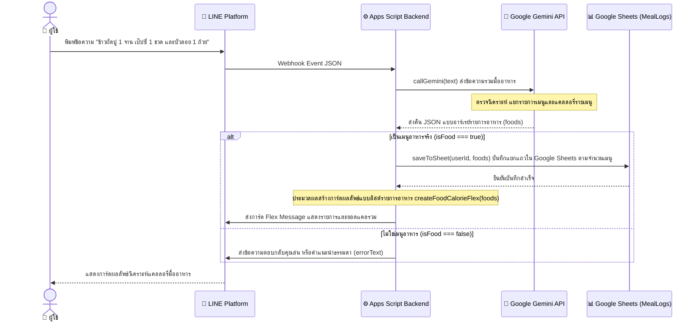

# แผนการพัฒนาคุณสมบัติระบบวิเคราะห์และบันทึกอาหารหลายรายการพร้อมกัน (Multi-Item Food Calorie Processing System)

ฟีเจอร์นี้มีเป้าหมายเพื่อตอบสนองความต้องการของผู้ใช้งานที่ทานอาหารหลายรายการในมื้อเดียวกัน (เช่น "ข้าวผัดปู 1 จาน เป๊ปซี่ 1 ขวด และบัวลอย 1 ถ้วย") โดยบอทจะส่งข้อมูลข้อความให้ Gemini AI แยกแยะชนิดอาหารและประมาณการแคลลอรี่รายเมนู จากนั้นทำการบันทึกข้อมูลแยกแถวลงฐานข้อมูล Google Sheets เป็นรายเมนูเพื่อให้การคำนวณและสรุปข้อมูลมีความแม่นยำสูง พร้อมแสดงผลลัพธ์ผ่านหน้าจอแชท Flex Message ดีไซน์พรีเมียมที่รวบรวมรายการอาหารทั้งหมดและยอดแคลลอรี่รวมในมื้อนั้นอย่างเป็นระเบียบ

---

## 🗺️ การออกแบบโครงสร้างและการไหลของข้อมูล (System Design)

ระบบนี้จะทำงานเชื่อมโยงข้อมูลหลายส่วนตามผังดังนี้ครับ:



---

## 🛠️ รายละเอียดการแก้ไขโค้ดโครงการ

### 1. การปรับปรุงระบบวิเคราะห์ของ AI (`callGemini`)
* **ปรับปรุง System Instruction:** สั่งการให้ Gemini AI ตรวจสอบว่ามีรายการอาหารหรือเครื่องดื่มตั้งแต่ 1 รายการขึ้นไปหรือไม่ หากมีให้แยกแยะรายการแต่ละรายการและประมาณการแคลลอรี่รายตัว
* **ปรับเปลี่ยน Schema การตอบกลับ:** บังคับให้ส่งค่า JSON รูปแบบใหม่ที่บรรจุอาร์เรย์รายการอาหาร (`foods`):
  ```json
  {
    "isFood": true,
    "foods": [
      { "name": "ข้าวผัดปู 1 จาน", "calories": 600 },
      { "name": "เป๊ปซี่ 1 ขวด", "calories": 140 },
      { "name": "ขนมบัวลอย 1 ถ้วย", "calories": 350 }
    ]
  }
  ```
* **ระบบความปลอดภัยย้อนหลัง (Backward Compatibility):** ในฟังก์ชันพาร์สข้อมูล หาก AI ตอบกลับในรูปแบบเมนูเดี่ยวเดิม (`Calories` ตัวพิมพ์ใหญ่และไม่มีฟิลด์อาร์เรย์) โค้ดจะแปลงเป็นรูปแบบอาร์เรย์ให้อัตโนมัติ เพื่อป้องกันระบบเออเร่อ
* **เพิ่มโทเค็นผลลัพธ์ (`maxOutputTokens`):** ขยายจากเดิม 150 เป็น 400 เพื่อรองรับข้อมูลรายการอาหารหลายรายการ

### 2. ปรับปรุงระบบบันทึกฐานข้อมูล (`saveToSheet`)
* ปรับฟังก์ชัน `saveToSheet(userId, foods)` ให้รับพารามิเตอร์ `foods` เป็นอาร์เรย์
* วนลูปข้อมูลในอาร์เรย์แล้วสั่ง `sheet.appendRow(...)` บันทึกแยกแถวลงในแผ่นงาน `MealLogs` ในการเชื่อมต่อเปิดชีตเพียงครั้งเดียว ซึ่งส่งผลดีต่อโครงสร้างข้อมูลดิบและการดึงยอดสรุปของวัน

### 3. ปรับปรุงดีไซน์ Flex Message แสดงผลลัพธ์รายมื้อ (`createFoodCalorieFlex`)
* ปรับฟังก์ชัน `createFoodCalorieFlex(foods)` ให้ดึงรายการอาหารแต่ละรายการออกมาเรนเดอร์ในรูปแบบตารางแนวตั้ง (Vertical Layout) ด้านขวาแสดงแคลลอรี่รายตัว
* คำนวณหาแคลลอรี่รวมของมื้อ (Total Calories) แสดงตัวเลขโดดเด่นสะดุดตาบริเวณส่วนล่างของการ์ด

### 4. ปรับปรุงตรรกะใน `doPost(e)`
* เปลี่ยนฟังก์ชันการรับข้อมูลจาก `callGemini` ให้เข้าตรรกะประมวลผลอาร์เรย์รายการอาหารและส่งไปบันทึก/ส่งข้อความแชท

---

## 🧪 แผนการทดสอบระบบ (Verification Plan)

### กรณีทดสอบที่ 1: การพิมพ์อาหารรายการเดียว (Single Item)
* **การป้อนข้อมูล:** พิมพ์ `"ข้าวมันไก่ผสมหมูกรอบ 1 จาน"`
* **ผลลัพธ์ที่คาดหวัง:** 
  * บันทึกข้อมูลลง Google Sheet แถวเดียว
  * ตอบกลับเป็นการ์ด Flex Message แสดงรายการเดียวและระบุแคลลอรี่รวม

### กรณีทดสอบที่ 2: การพิมพ์อาหารหลายรายการพร้อมกัน (Multi-Item)
* **การป้อนข้อมูล:** พิมพ์ `"ข้าวผัดปู 1 จาน เป๊ปซี่ 1 ขวด และ ขนมบัวลอย 1 ถ้วย"`
* **ผลลัพธ์ที่คาดหวัง:** 
  * บันทึกข้อมูลลง Google Sheet แยกกัน 3 แถวอัตโนมัติ
  * ตอบกลับเป็นการ์ด Flex Message แสดงรายการเมนูทั้ง 3 เมนูคู่กับแคลลอรี่แต่ละตัว และคำนวณยอดแคลรวมแสดงเด่นชัด `1090 kcal`

### กรณีทดสอบที่ 3: ข้อความทักทายหรือคำทั่วไป (Non-Food Item)
* **การป้อนข้อมูล:** พิมพ์ `"สวัสดีบอทแคลลอรี่"`
* **ผลลัพธ์ที่คาดหวัง:** บอทตอบกลับทักทายแนะนำตัวเป็นข้อความธรรมดาตามปกติ ไม่บันทึกข้อมูลลงสมุดโน้ต
